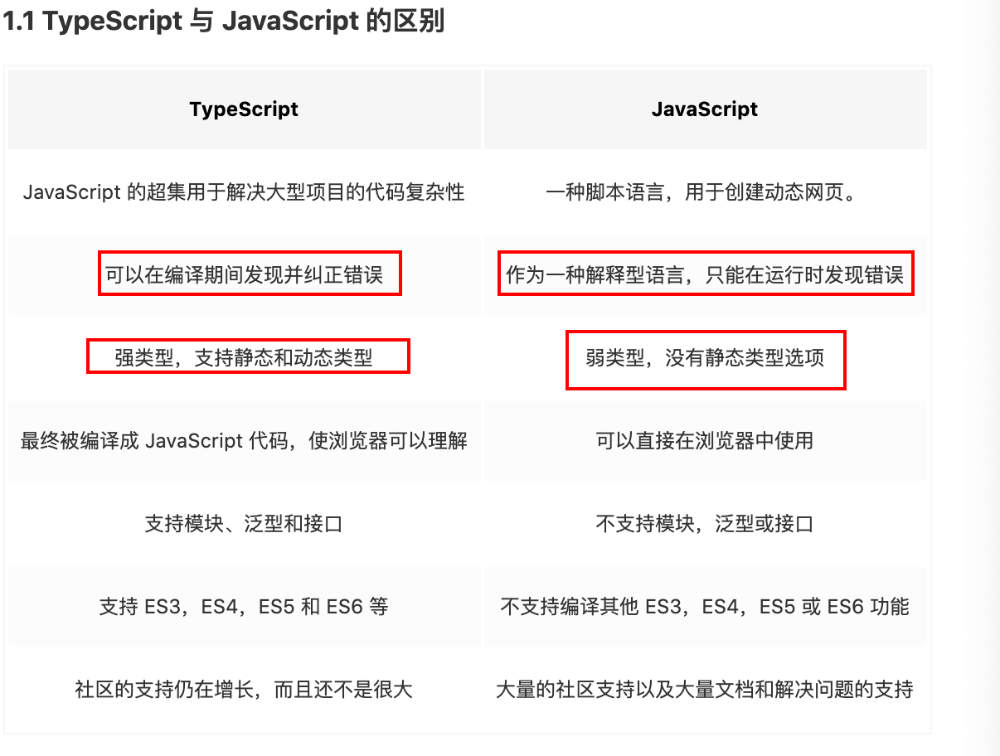

[toc]



# 基础知识

> 包括boolean\number\string\array\enmu(数字枚举、字符串枚举、异构枚举)\any\ `unknow`\Tuple\void\null\undefined\never

# 基础类型

### 数组

```ts
let a: number[];

// 泛型语法
let b: Array<number>
```

#### unknow
就像所有类型都可以赋值给 any，所有类型也都可以赋值给 unknown。这使得 unknown 成为 TypeScript 类型系统的另一种`顶级类型`（另一种是 any）

我们可以给 `unknown` 类型的变量赋值任何类型的值； **但是我们只能把 `unknown` 类型的变量赋值给 `any`类型和 `unknown` 类型本身**

这是有道理的：**只有能够保存任意类型值的容器才能保存 unknown 类型的值**。
```ts
let value: unknown;

let value1: unknown = value; // OK
let value2: any = value; // OK
let value3: boolean = value; // Error
let value4: number = value; // Error
let value5: string = value; // Error
let value6: object = value; // Error
let value7: any[] = value; // Error
let value8: Function = value; // Error

```
TypeScript 可以给any 类型的值进行任何操作； 但是unknown 类型不行
```ts
let value: any;

value.foo.bar; // OK
value.trim(); // OK
value(); // OK
new value(); // OK
value[0][1]; // OK


let value: unknown;

value.foo.bar; // Error
value.trim(); // Error
value(); // Error
new value(); // Error
value[0][1]; // Error

```

#### void 没有任何类型

某种程度上来说，void 类型像是与 any 类型相反，它表示没有任何类型。
当一个函数没有返回值时，你通常会见到其返回值类型是 void：

声明一个void类型的变量没有什么大用，因为你只能为它赋予`undefined`和 `null`;
通常用着函数没有返回值时使用
```ts
// 声明函数返回值为void
function warnUser(): void {
  console.log("This is my warning message");
}

```

#### null、undefined

- 默认情况下null和undefined是所有类型的子类型; 可以赋值给任意类型；
- 当你指定了`--strictNullChecks` 标记，null和undefined只能赋值给`void`和它们各自

#### never

never 类型表示的是那些永不存在的值的类型。
例如，never 类型是那些总是会抛出异常或根本就不会有返回值的函数表达式或箭头函数表达式的返回值类型。

```ts
// 返回never的函数必须存在无法达到的终点
function error(message: string): never {
  throw new Error(message);
}

function infiniteLoop(): never {
  while (true) {}
}
```

**在 TypeScript 中，可以利用 never 类型的特性来实现全面性检查，具体示例如下：**
```ts
type Foo = string | number;

function controlFlowAnalysisWithNever(foo: Foo) {
  if (typeof foo === "string") {
    // 这里 foo 被收窄为 string 类型
  } else if (typeof foo === "number") {
    // 这里 foo 被收窄为 number 类型
  } else {
    // foo 在这里是 never
    const check: never = foo;
  }
}

```
通常用于约束函数的返回值，表示该函数永远不可能结束；
表示一个不包含值的类型， 即表示永远不存在的值。

- 拥有 void 返回值类型的函数能正常运行。拥有 never 返回值类型的函数无法正常返回，无法终止，或会抛出异常。

### 元组 Tuple

数组一般由同种类型的值组成，但有时我们需要在单个变量中存储不同类型的值，这时候我们就可以使用元组

一个带不同值的数组 tuple

- 在元组初始化的时候，我们还必须提供每个属性的值，不然也会出现错误，
```ts
let tupleType: [string, boolean] = ['hello']
```

**当添加越界的元素时，它的类型会被限制为元组中每个类型的联合类型：**
```ts
let arr: [string, number] = ['hahah', 99]
// 直接给元组赋值，要完全提供其定义好的类型和长度

// 当添加越界的元素时，它的类型会被限制为元组中每个类型的联合类型：
arr.push(77);

arr.push(true); // error
```

### 类型断言
有时候你会遇到这样的情况，你会比 TypeScript 更了解某个值的详细信息。通常这会发生在你清楚地知道一个实体具有比它现有类型更确切的类型。

- 类型断言有两种形式：
**“尖括号” 语法**
```ts
let someValue: any = "this is a string";
let strLength: number = (<string>someValue).length;

```

**as 语法**
```ts
let someValue: any = "this is a string";
let strLength: number = (someValue as string).length;
```


### 类型守卫
类型保护是可执行运行时检查的一种表达式，目前主要有四种的方式来实现类型保护：

#### in关键字
```ts
interface Admin {
  name: string;
  privileges: string[];
}

interface Employee {
  name: string;
  startDate: Date;
}

type UnknownEmployee = Employee | Admin;

function printEmployeeInformation(emp: UnknownEmployee) {
  console.log("Name: " + emp.name);
  if ("privileges" in emp) {
    console.log("Privileges: " + emp.privileges);
  }
  if ("startDate" in emp) {
    console.log("Start Date: " + emp.startDate);
  }
}


```
#### typeof 关键字
```ts
function padLeft(value: string, padding: string | number) {
  if (typeof padding === "number") {
      return Array(padding + 1).join(" ") + value;
  }
  if (typeof padding === "string") {
      return padding + value;
  }
  throw new Error(`Expected string or number, got '${padding}'.`);
}

```

#### instanceof 关键字
```ts
interface Padder {
  getPaddingString(): string;
}

class SpaceRepeatingPadder implements Padder {
  constructor(private numSpaces: number) {}
  getPaddingString() {
    return Array(this.numSpaces + 1).join(" ");
  }
}

class StringPadder implements Padder {
  constructor(private value: string) {}
  getPaddingString() {
    return this.value;
  }
}

let padder: Padder = new SpaceRepeatingPadder(6);

if (padder instanceof SpaceRepeatingPadder) {
  // padder的类型收窄为 'SpaceRepeatingPadder'
}


```

#### 自定义类型保护的类型谓词
```ts
function isNumber(x: any): x is number {
  return typeof x === "number";
}

function isString(x: any): x is string {
  return typeof x === "string";
}

```


# 扩展类型

先说下字面量形式

```ts
let a: 1; // 声明a的变量类型为字面量 1；这时a 赋值只能是1而不能是其他数；
a = 1;


```

> 扩展类型： 联合类型、类型别名、枚举、接口、类

# 联合类型

联合类型通常与 null 或 undefined 一起使用

```ts
const sayHello = (name: string | undefined) => {
  /* ... */
};


let a: string | number;

a = 'hahha';

a = 123

```
### 可辨识联合
也称为代数数据类型或标签联合类型。它包含 3 个要点：**可辨识、联合类型和类型守卫**。

这种类型的本质是结合联合类型和字面量类型的一种类型保护方法。
如果一个类型是多个类型的联合类型，且多个类型含有一个公共属性，那么就可以利用这个公共属性，**来创建不同的类型保护区块。**
```ts


enum CarTransmission {
  Automatic = 200,
  Manual = 300
}

interface Motorcycle {
  vType: "motorcycle"; // discriminant
  make: number; // year
}

interface Car {
  vType: "car"; // discriminant
  transmission: CarTransmission
}

interface Truck {
  vType: "truck"; // discriminant
  capacity: number; // in tons
}
// Motorcycle、 Car 和 Truck 三个接口，在这些接口中都包含一个 vType 属性，该属性被称为可辨识的属性，而其它的属性只跟特性的接口相关。


// 基于前面定义了三个接口，我们可以创建一个 Vehicle 联合类型：
type Vehicle = Motorcycle | Car | Truck;

const EVALUATION_FACTOR = Math.PI; 
function evaluatePrice(vehicle: Vehicle) {
  switch(vehicle.vType) {
    case "car":
      return vehicle.transmission * EVALUATION_FACTOR;
    case "truck":
      return vehicle.capacity * EVALUATION_FACTOR;
    case "motorcycle":
      return vehicle.make * EVALUATION_FACTOR;
  }
}

// 在以上代码中，我们使用 switch 和 case 运算符来实现类型守卫，从而确保在 evaluatePrice 方法中，我们可以安全地访问 vehicle 对象中的所包含的属性，来正确的计算该车辆类型所对应的价格。
```

# 类型别名

类型别名会给`一个类型`起个新的名字。关键字： `type`；  每个类型是`或`的关系；
```ts
type Message = string | number;

interface A {
	name: string;
	age: number;
}

interface B {
	sex: string;
	run: string;
}

type AB = A | B; // 类型别名只能是 接口A 或 接口 B

let c: AB = {
	name: 'sdasd',
	sex: 'man'  // 不行会报错   接口A和B 没有同时包含 name 和 sex 属性的对象；
}

```

## 交叉类型 &

交叉类型是将多个类型合并为一个类型； 这让我们可以把现有的多种类型叠加到一起成为一种类型，它包含了所需的所有类型的特性。

使用交叉类型可以实现类似的组合效果， 需要通过 ``` & ```， 叫做交叉类型

```ts

interface IPerson {
	id: string,
	age: number
}

interface IWorker {
	companyId: string
}

type IStaff = IPerson & IWorker;

const staff: IStaff = {
	id: 'abc',
	age: 90,
	companyId: 'cba'
}

```

# 枚举

枚举通常用于约束某个变量的取值范围。 枚举分：`数字枚举`、`字符串枚举`、`异构枚举`(字符串和数字枚举的混合)

字面量和联合类型配合使用， 也可以达到同样的目标；

```ts
 let name: 'hzg';
 name = 'hzg'; // 字面量类型， 只能赋值给字面量

 let a: '1' | '2' = '2'; // 字面量类型和联合类型
```

### 字面量类型的问题

- 在类型约束位置， 会产生重复代码。 可以使用类型别名解决该问题。
- 逻辑含义和真实的值产生了混淆， 会导致当修改真实的值的时候，产生大量的修改。
- 字面量类型不会进入到编译结果；

如何定义一个枚举

```ts
	enum 枚举名 {
		枚举字段1 = 值1,
		枚举字段2 = 值2
	}
```
``` ts
// 字符串枚举
	enum Gender {
		male = '男',
		female = '女'
	}

	let gender: Gender;
	gender = Gender.male;
```

**枚举会参与编译， 会出现在编译结果中出现**；编译结果中表现是一个对象； 字面量方式不会出现在编译结果中；

枚举的规则：

- 枚举的值可以是字符串和数字
- 数字枚举的值会自动自增；
- 被数字枚举约束的变量，可以直接赋值为数字；
- 数字枚举的编译结果和字符串枚举有差异；

```ts
// 数字枚举
 enum Level {
	 level1 = 1,
	 level2,
	 level3
 }

 Level['level1'] === 1 // true

 Level[1] === 'level1' // true
```


```ts
enum Level {
	 level1 = 1,
	 level2,
	 level3
 }

// 数字枚举的编译结果 和 字符串编译结果的差异
//  提供的一个便利是你可以由枚举的值得到它的名字  Level[2] === 'level2'  数字枚举的值会相互映射

{
	level1: 1,
	level2: 2,
	level3: 3,
	'1': 'level1',
	'2': 'level2',
	'3': 'level3'
}

// 字符串枚举编译结果
enum Level2 {
	a = '1',
	b = '2'
}

{
	a: '1',
	b: '2'
}

```

### 常量枚举与普通枚举的区别

- 常量枚举会在编译阶段被删除
- 常量枚举不能包含计算成员，如果包含了计算成员，则会在编译阶段报错

```ts
const enum Colors { // 多个const 就是常量枚举
	Red,
	Yellow,
	Blue
}
// 常量枚举不会出现在编译结果中

let myColors = [Colors.Red, Colors.Yellow, Colors.Blue];
// 使用常量枚举编译的结果
let myColors = [0 /* Red */, 1 /* Yellow */, 2 /* Blue */];

```
- 常量枚举不能包含计算成员，如果包含了计算成员，则会在编译阶段报错
```ts
// 报错
const enum Color {Red, Yellow, Blue = "blue".length};
console.log(Colors.Red);


```

**最佳实践**

- 尽量不要在一个枚举中即出现`字符串字段`又出现`数字字段`；即不要使用异构枚举；
- 使用枚举时，尽量使用枚举字段的名称， 而不是使用真实的值；
- 相比使用字面量对象维护常量，const enum 可以提供更安全的类型检查

```ts
// 使用 const enum 维护常量
const enum TODO_STATUS {
  TODO = 'TODO',
  DONE = 'DONE',
  DOING = 'DOING'
}

function todos (status: TODO_STATUS): Todo[];

todos(TODO_STATUS.TODO)


```

### 扩展的知识： 位枚举（枚举的位运算）

只针对数字枚举

位运算： 两个数字换算成二进制后进行的运算；

```ts
// 位枚举  两个数字换算成二进制后进行的运算；
enum Permission {
	Read = 1, // 2^0  二进制 0001  根据每个位置上的标识来判断是否有对应的权限； 1代表有权限；
	Write = 2, // 2^1	0010
	Create = 4, // 2^2	0100
	Delete = 8 // 2^3	1000
}

// 1: 如何组合权限
// 使用或运算 
// 0001
// | 或运算  一个为真就为真，全假为假
// 0010
// ----
// 0011
let p: Permission = Permission.Read | Permission.Write;
p = p | Permission.Delete; // 1011

// 2: 如何判断是否拥有某个权限；
/**
 * 
 * @param targe 需要判断的目标
 * @param per 对应的真实权限
 */
// 0011
// & 且运算 全真为真， 否者为假
// 0001
// ----
// 0001
function hasPermission(target:Permission, per:Permission) {
	return (target & per) === per; 
}

// 判断变量p是否拥有可读权限
console.log(hasPermission(p, Permission.Create));

// 3:如何删除某个权限  (删除写权限)
// 0011
// 异或   相同取0，不同取1
// 0010
// ----
// 0001

p = p ^ Permission.Write;

```

# 模块化

> 前端模块化的标准： ES6、commonjs、amd、umd、system、esnext

### TS中如何书写模块化语句

> TS 中导入和导出模块， `统一使用ES6的模块化` 避免出错; 
 
普通导出 可以智能提示， 快速修复； 默认导出（ `export default`)， 不能智能提示； 因为可以修改导出的名字；

不要加后缀名；编译结果中没有`.ts`文件

### 编译结果中的模块化

dist 文件夹   编译命令 tsc; `tsc --watch`、`ts -w` 监听文件变化，文件变化后会重新编译；

去掉编译结果中的注释 tsconfig.json中 加`"removeComments: true"`

|		配置名称		 |		含义		|		推荐值		|
| :-------------------: | :---------------:| :-------------: |
| module				| 设置编译结果中使用的模块化标准 | esnext  |
| moduleResolution		| 设置解析模块的模式 |		node 		|
| noImplicitUseStrict	| 编译结果中不包括"use strict" |  true  |
| removeComments 		| 编译结果中移除注释 |		toUpperCase  |
| noEmitOnError			| 错误时不生成编译结果 |	true 		|
| esModuleInterop 		| 启用es模块化交互非es模块导出 | true 	|

TS中的模块化在编译结果中：
- 如果编译结果的模块化标准是ES6: 没有区别；
- 如果编译结果的模块化标准是commonJs： 导出的声明会变成exports的属性。 默认的导出会变成exports的default属性；导入时会把对象拿到； 通过对象属性的方式执行；

### 解决默认导入的错误

```ts

import fs from 'fs';// 会报错； 因为fs模块采用的是 module.exports = {}; 方式导出的； 不是采用es6默认导出方式；

// 解决方式

import * as fs from 'fs';
import { readFileSync } from 'fs';

// 上面两种方式可以解决默认导入的错误；

// 或者编译选项中增加配置； 直接导入就不会出错
// esmoduleInterop : true 

```


# 如何在TS中书写commonjs模块化代码

不太建议；建议使用es6模块化   

```js
// 老式方式 没有类型推导  module.exports = xxx;  const xxx = require('xxx');
// 导出  export = XXX
export = {

}

// 导入 import xxx = require('xxx')

import myModule = require('./myModule')
```


# 模块解析

模块解析： 应该从什么位置寻找模块
TS中， 有两种模块解析策略

- classic: 经典
- node: node解析策略（唯一变化， 将js替换为ts);

> 增加模块解析策略配置： `moduleResolution: 'node'` 强行设置为node解析策略


# 接口和类型兼容性

接口： `interface` 和类型别名 `type` 最大区别在于约束类上面

# 扩展类型 - 接口
自己定义的类型    类型别名、枚举、接口、类

> TypeScript的接口： 用于约束类、对象、函数的契约（标准）

契约（标准）的形式
- 文档：如Api文档， 弱标准
- 代码约束，强标准

> 接口和类型别名一样， 不会出现在编译结果中的；

1. 接口约束对象

```ts
// 接口来约束对象
interface User {
	name: string,
	age: number
}

let u:User = {
	name: 'hzg',
	age: 18
}

// 类型别名约束对象
 type User = {
	name: string,
	age: number
 }

let uu: User;

// 从上面看类型别名和接口来约束对象没啥区别

```

**接口可以继承** 

可以通过接口之间的继承， 实现多种接口的结合

与**交叉类型**的区别是 交叉类型re是类型之间的组合，而接口之间的继承是类型之间的组合外还可以扩展类型；

```ts
interface Shape {
    color: string;
}

interface PenStroke {
    penWidth: number;
}

interface Square extends Shape, PenStroke {
    sideLength: number;
}

let demo: Square = {
	color: 'red',
	penWidth: 90,
	sideLength: 89
}
```

> 接口和类型别名的最大区别： 接口可以被类实现 `implements`， 而类型别名不可以； **TypeScript用它来明确的强制一个类去符合某种契约**

```ts
interface Basic {
	name: string;
	age: number;
}


class Person implements Basic {
	name: string;
	age: number;
	constructor(name: string, age: age){
		this.name = name;
		this.age = age;
	}
}


```
它们的区别：
- 子接口不能覆盖父接口的成员；
- 交叉类型会把相同成员进行交叉；

**readonly**

只读修饰符：不能重新赋值； 不在编译结果中；（不参与编译）

```ts
interface User{
	readonly id: number,
	user: string, 
}

let u = {
	id: 2323,
	user: 'hzg'
}

let arr: readonly numbe[] = [1,2,3,4,5]; // 这样的数组所有的改变原数组的方法都不可用了， 如push、pop

const arr1 = readonlyArray<number> = [1,2,3,4,5];

type Us = {
	readonly id: number,
	readonly name: readonly number[] // name 数组不能改变， 里面的值 初次赋值后也不能重新赋值；
}


```
# TypeScript 类

在 TypeScript 中，我们可以通过 Class 关键字来定义一个类：
```ts
	class Greeter {
		// 静态属性
		static cname: string = 'Greeter';
		// 成员属性  实例属性
		greeting: string;
		// 构造函数 - 执行初始化操作
		constructor(message: string) {
			this.greeting = message;
		}
		// 静态方法
		static getClassName() {
			return 'class name is Greeter';
		}
		// 成员方法   实例属性
		greet() {
			return 'heelo', this.greeting;
		}
	}


	let greeter = new Greeter("world");

```

### 接口继承类

- 当接口继承了一个类类型时，它会`继承类的成员`但不包括其实现。 就好像接口声明了所有类中存在的成员，但并没有提供具体实现一样。 **接口同样会继承到类的private和protected成员。** 这意味着当你创建了一个接口继承了一个拥有私有或受保护的成员的类时，这个接口类型**只能被这个类或其子类所实现（implement）**。
```ts

class A {
	a1: string = '';

}
class B {
	b1: number = 1
}

interface C extends A, B {}

class D implements C {
	a1: string;
	b1: number;
}


// 类的私有属性被接口继承
class A {
	private a1: string = '';

}
class B {
	b1: number = 1
}

// 这个接口只能被继承的A类的子类实现（implements)
interface C extends A, B {}

class D extends A implements C {
	b1: number;
}


```

# 索引器(索引签名)

`对象[值]` 使用成员表达式

在Ts中， 默认情况下对索引器（成员表达式）不做严格的类型检查；

```ts
	u['xxx'] // []是运行后才得到的表达式， 所以不做类型检查
```
使用配置`noImplicitAny`开启`隐式any`检查。 强约束

隐式any： TS根据实际情况推导出的any情况  

```ts
// n 会被推导出是any类型
 function t(n){}


 class {
	 [prop: string]: any;

	 constructor (
		 public name: string,
		 public age: string
	 )
 }
```

在索引器中， 键的类型可以是字符串或数字


在类中， 索引器书写的位置应该是在所有成员之前

TS中索引器的作用

- 在严格的检查下， 可以实现为类动态增加成员
- 可以实现动态的操作类成员

在`JS`中， 所有的成员名本质上， 都是字符串， 如果使用数字作为成员名， 会自动转换为字符串

在TS中， 如果某个类中使用了两种类型的索引器， 要求两种索引器的值类型必须匹配

**数字索引的返回值必须是字符串索引返回值类型的子类型。** 这是因为当使用 number来索引时，JavaScript会将它转换成string然后再去索引对象。 也就是说用 100（一个number）去索引等同于使用"100"（一个string）去索引，因此两者需要保持一致。
```ts
const arr3: number[] = [];
arr3[0] = 1;
arr3['0'] = 5; // noImplicitAny: true 时会报错， 隐式的any类型

console.log(arr3[0]);

// 在JS中， 所有的成员名本质上， 都是字符串， 如果使用数字作为成员名， 会自动转换为字符串

class A {
	[prop: number]: string
}

const a = new A();

a[1] = 9; // 会报错 因为成员名会被转换为string类型； 和索引器number类型冲突
```


# 类型兼容性

B -> A , 如果能完成赋值， 则B和A类型兼容；

鸭子辨型法(子结构辨型法)； 满足特征就行；如：是否是🦆， 1、会嘎嘎叫 2、会游泳
是不是一只鸭子， 拥有鸭子的特征就行

目标类型需要某一些特征， 赋值的类型只要能满足该特征即可

- 基本类型： 完全匹配

- 对象类型： 鸭子辨型法（满足特征就行）

```ts

interface Duck {
	sound: '嘎嘎嘎'
	swin(): void
}


let person = {
	name: '伪装成鸭子的人',
	age: 11,
	sound: '嘎嘎嘎' as '嘎嘎嘎',
	swin() {
		console.log('gagga')
	}

}
// 声明一个变量， 约束为一个鸭子但是可以把人赋值给他； 
let duck: Duck = person;


```
> 当我们比较两种不同的类型时，并不在乎它们从何处而来，如果所有成员的类型都是兼容的，我们就认为它们的类型是兼容的。

然而，当我们比较带有 private或 protected成员的类型的时候，情况就不同了。 **如果其中一个类型里包含一个 private成员，那么只有当另外一个类型中也存在这样一个 private成员， ` 并且它们都是来自同一处声明时 `，我们才认为这两个类型是兼容的。** 对于 protected成员也使用这个规则。

```ts

class Animal {
    private name: string;
    constructor(theName: string) { this.name = theName; }
}

class Rhino extends Animal {
    constructor() { super("Rhino"); }
}

class Employee {
    private name: string;
    constructor(theName: string) { this.name = theName; }
}

let animal = new Animal("Goat");
let rhino = new Rhino();
let employee = new Employee("Bob");

animal = rhino;
animal = employee; // 错误: Animal 与 Employee 不兼容. 尽管 Employee里也有一个私有成员 name，但它明显不是 Animal里面定义的那个。


```


对象：当直接使用**对象字面量赋值时**， 将采用`更加严格的`判断

- 函数类型

一切无比的自然： 
**函数参数**: 传递给目标函数的参数可以少(值可选时）， 但不可以多
**返回值**：要求返回必须返回， 且类型相同； 不要求返回，你随意

- 参数类型和返回类型
```ts

	function createUserId(name: string, id: number): string {
		return name + id;
	}
```

- 函数类型
```ts
	// 定义一个变量IdGenerator; 类型为一个函数
	let IdGenerator: (chars: string, nums: number) => string;

	function createUserId(name: string, id: number): string {
	return name + id;
	}

	IdGenerator = createUserId; // 对变量赋值
```
- 可选参数及默认参数
可选参数必须放在参数的最后面
```ts
// 可选参数
function createUserId(name: string, age: number, id?: number): string {
  return name + age;
}

// 默认参数
function createUserId(
  name: string = "Semlinker",
  id: number,
  age?: number,
): string {
  return name + id;
}

```

# 函数重载  ???

函数重载或方法重载是使用相同名称和不同参数数量或类型创建多个方法的一种能力。
**参数不同**（参数类型不同、参数个数不同或参数个数相同时参数的先后顺序不同），调用时根据实参的形式，选择与它匹配的方法执行操作的一种技术。

在定义重载的时候，一定要把最精确的定义放在最前面
```ts
function add(a: number, b: number): number;
function add(a: string, b: string): string;
function add(a: string, b: number): string;
function add(a: number, b: string): string;
function add(a: Combinable, b: Combinable) {
  if (typeof a === "string" || typeof b === "string") {
    return a.toString() + b.toString();
  }
  return a + b;
}

```

# TS中的类

面向对象思想 很难理解   小有成就三年

基础部分， 学习类的时候， 仅讨论新增的语法部分。

- 类的继承： 父类又叫做基类、超类， 子类又叫做派生类

**属性**

使用属性列表来描述类中属性
```ts
class User {
	// 用属性列表来表明类有哪些属性
	readonly id: number = 1; // 只读属性必须在声明或构造函数里面被初始化， 
	name: string;
	age: number;
	// gender: 'male' | 'female' = 'male' // <1> 属性初始化 默认值   在属性列表中
	pid ?: string  // 属性可选  string | undefined  可选的就不必为必须初始化

	constructor(name: strinng, age: number, gender: 'male' | 'female' = 'male') {
		this.name = name;
		this.age= age;
		this.gender = gender;  // <2> 初始化默认值在构造函数中 属性默认值
	}
}

const obj = {};
obj.a = 'aaa';
// 在Ts中上面的写法会报错； 一个对象在创建的时候，它的属性应该就要创建下来； 后面的属性不能随意的增加；
```


**属性的初始化检查** 没有赋值时 值为 `undefined`

`strictPropertyInitializtion: true`  更加严格的属性初始化检查； 除可选属性外声明时必须初始化

属性的初始化位置：
1. 构造函数中；
2. 属性的默认值

- 属性可以修饰为可选的； 可选的就不必为必须初始化 `?:`
- 属性可以修饰为只读的 `readonly`  `只读属性必须在声明时或构造函数里被初始化。不然实例化时值为undefined, 不能再次赋值了`

- 使用访问修饰符 | 访问限定符
	- 访问修饰符可以控制类中的某个成员(方法、属性）的访问权限
	- public: 默认的访问修饰符，公开的。所有的代码都可以使用； 不写修饰符默认都是`public`
	- private: 私有的， 只能在类的里面使用
	- protected: 受保护的， `能在类的里面和子类中使用`

	```ts
	// 构造函数也可以被标记成 protected。 这意味着这个类不能在包含它的类外被实例化，但是能被继承。
	class Person {
		protected name: string;
		protected constructor(theName: string) { this.name = theName; }
	}

	// Employee 能够继承 Person
	class Employee extends Person {
		private department: string;

		constructor(name: string, department: string) {
			super(name); // 调用父类的构造函数
			this.department = department;
		}

		public getElevatorPitch() {
			return `Hello, my name is ${this.name} and I work in ${this.department}.`;
		}
	}

	let howard = new Employee("Howard", "Sales");
	let john = new Person("John"); // 错误: 'Person' 的构造函数是被保护的.
	 
	```

#### 属性简写

如果某个属性， 通过构造函数的参数传递， 并且不做任何处理的赋值给该属性。 可以进行简写； 参数前添加访问修饰符；  不需要写属性列表和属性赋值

```ts 
class User {
	// name: string  
	constructor(public name: string, public age: number) {
		// this.name = name;
		// this.age = age;  属性简写 前面加修饰符 可省属性列表和属性赋值
	}
}
```


#### 访问器  setters getters

作用： 用于控制属性的读取和赋值

```ts

class User {
	readonly id: number;
	gender : 'male' | 'female' = 'male';
	pid?: string;

	constructor(public name: string, private _age: number) {
		this.id = Math.random();
	}

	get age() {
		return this._age;
		// 
	}

	set age(val: number) {
		this._age = val;
	}

}

// 死循环不一定导致内存泄漏  无限递归一定导致内存泄漏
```
- 只带有 get不带有 set的存取器自动被推断为 `readonly`。

### 单根性和传递性

单根性： 每个类最多只能拥有一个父类（类与类之间只能进行单继承， 想要实现多继承可以采用Mixins方式

```ts
  // Person 类
  class Person {
      name: string;
      sayHello() {
          console.log('tag', `Helo ${ this.name }!`)
      }
  }

  // Student 类
  class Student {
      grade: number;

      study() {
          console.log('tag', ' I need Study!')
      }
  }

  // 把类当做接口 
  class SmartObject implements Person, Student {

      // Person
      name: string = 'person';
      sayHello: () => void;
      // Activatable
      grade: number = 3;
      study: () => void;
  }


```


传递性： 如果A是B的父类， 并且B是C的父类， 则可以认为A也是C的父类；


# 抽象类和抽象方法

### 抽象类

有时， 某个类只表示一个抽象概念， `主要用于提取子类共有的成员`， 而不能直接创建它的对象，不是实例化， 只是用来继承。 该类可以作为抽象类；`chess.ts`

给类前面加上```abstruct```,表示该类是一个抽象类， 不可以创建一个抽象类的对象

### 抽象成员

父类中， 可能知道有些成员是必须存在的， 但不知道该成员的值或实现是什么， 因此， 需要一个强约束， 让继承该类的子类， 必须要实现该成员。

`抽象类中`，可以有抽象成员， 这些抽象成员必须在子类中实现


1. 使用 `abstract` 修饰符修饰的类被称为抽象类；
	抽象类不能实例化对象， 只能被继承；

2. 使用 `abstract` 修饰符修饰的方法或属性被称为抽象方法或抽象属性；
	抽象方法不能有方法体， 子类必须重写抽象类中所有的抽象方法和抽象属性；


3. 抽象类中不一定包含抽象方法， 但包含抽象方法的类一定是抽象类；

###  设计模式 - 模板模式

模板模式： 有些方法， 所有的子类实现的流程完全一致， 只是流程中某个步骤的具体实现不一样， 可以将该方法提取到父类， 在父类中完成整个流程的实现， 遇到实现不一致的方法时， 将该方法做出抽象方法；

### 静态成员

静态成员： 静态属性、静态方法; 指附着在类上的成员（属于某个构造函数的成员）

使用static 修饰的成员， 是静态成员；

实例成员： 对象成员、属于某个类的对象

静态成员： 非实例成员， 属于某个类；

### 静态方法中的this

实例方法中this指向的是 `当前对象`

静态方法中this指向的是 `当前类`

### 设计模式 - 单例模式

单例模式： `某些类的对象， 在系统中最多只能有一个`， 为了避免开发者造成随意创建多个类对象的错误， 可以使用单例模式进行强约束；

```ts

class Board {
	 width: number = 500;
	 height: number = 700;

	 init() {
		 console.log('初始化棋盘')
	 }

	// 构造函数私有化 在类外面不可实例化
	 private constructor() {} 

	 private static _board?: Board;

	// 静态方法
	 static createBoard(): Board {
		 if(this._board) {
			 return this._board;
		 }

		 this._board = new Board();
		 return this._board;
	 }


	 static readonly singleBoard: Board = new Board();
 }
```


# 泛型

设计泛型的关键目的是在成员之间提供有意义的约束，这些成员可以是：类的实例成员、类的方法、函数参数和函数返回值。

有时，书写某个函数时， 会丢失一些信息（`多个位置的类型应该保持一致`或有关联的信息）

泛型： 是指`附属于`（附加一个类型）函数、类、接口、类型别名之上的类型；
> 注意： 无法创建泛型枚举和泛型命名空间
> 使用 <T> 代表类型的变量, T 只是约定用法，可以任意指定。

常用的泛型变量代表

- T（Type）：表示一个 TypeScript 类型
- K（Key）：表示对象中的键类型
- V（Value）：表示对象中的值类型
- E（Element）：表示元素类型


泛型相当于一个类型的变量，在定义时，无法预先知道具体的类型，可以用该变量来替代，`只有调用时， 才能确定他的类型`； 使用泛型会得到更加一致的类型检查；

很多时候， TS会智能的根据传递的参数， 推导出泛型的具体类型；

如果无法完成推导， 并且又没有传递具体的类型， 默认为空对象类型；

> 泛型可以设置默认值；`<T = number>`


### 泛型接口

```ts
interface Person<T> {
	name: T
}


```
### 在函数中使用泛型

在函数名之后写上```<泛型名称>```

```ts
function take<T = number>(arr: T[], n: number): T[] {

}


take<number>([1,2,4,5,6], 3)
```

### 在类型别名、接口、类中使用泛型

直接在名称之后写上 ```<泛型名称>```


### 泛型类

```ts

 interface GenericInterface<U> {
	 value: U,
	 getIdentity: () => U
 }

 class IdentityClass<T> implements GenericInterface<T> {
	 value: T;
	 constructor(value: T) {
		 this.value = value;
	 }

	 getIdentity(): T {
		 return this.value;
	 }
 }


 const myNumberClass = new IdentityClass<number>(789)


```

### 泛型约束

泛型约束用于限制泛型的取值；

> 泛型无法知道具体的类型，所以无法操作它的属性和方法

当你明确知道泛型中有哪些属性方法时，可以通过 `extends` 进行泛型约束,写在声明函数名的后面
```ts
interface hasNameProperty {
	name: string
}

/**
 * 将某个对象的name属性的每个单词的首字母大写，并将该对象返回；
 */

 // 泛型将来可以是任何类型；
function nameToUppercase<T extends hasNameProperty>(obj: T): T {
	// obj.name  // 没有约束时   将来传的值不是对象， 或者对象没有name属性 就报错

	obj.name = obj.name.split(' ').map(it => it[0].toUpperCase() + it.substr(1)).join(' ');
	return obj
}
//  还可以使用 , 号来分隔多种约束类型 比如<T extends Length, Type2, Type3>


const o = {
	name: 'kevin he',
	age: 9,
	gender: 'meal'
};


const newO = nameToUppercase(o);

console.log(newO);
```
### 泛型约束 检查对象上的属性是否存在

### typeof
在 TypeScript 中，typeof 操作符可以用来获取一个`变量声明`或`对象`的类型。

```ts
interface Person {
  name: string;
  age: number;
}

const sem: Person = { name: 'semlinker', age: 30 };
type Sem= typeof sem; // -> Person

function toArray(x: number): Array<number> {
  return [x];
}

type Func = typeof toArray; // -> (x: number) => number[]
```
#### keyof 操作符
用于获取某种类型的所有键， 返回类型是联合类型

```ts

interface Person {
	name: string;
	age: number;
	location: string;
}

type k1 = keyof Person; // 'name' | 'age' | 'location'
type k2 = keyof Person[]; // number | 'length' | 'push' | 'concat' | ...  number ??????
type k3 = keyof { [x: string]: Person }; // string | number  ????

// 通过 keyof 操作符，我们就可以获取指定类型的所有键，

// 我们就可以使用extends 约束， 限制输入的属性名包含在keyof 返回的联合类型中

function getProperty<T, K extends keyof T>(obj: T, key: K): T[K] {
	return obj[key]
}

```

### in
in 用来遍历枚举类型：
```ts

type Keys = "a" | "b" | "c"

type Obj =  {
  [p in Keys]: any
} // -> { a: any, b: any, c: any }

```
### 多泛型

```ts
	// 将两个数组 [1,2,3] + ['a', 'b', 'c'] = [1, 'a', 2, 'b', 3, 'c']
	function mixinArray(T, K)(arr1: T[], arr2: K[]): (T | K)[] {
		if(arr1.length === arr2.length) {
			throw new Error("两个数组的长度不等！")
		}

		const result: (T | K)[] = [];
		for(let i, len = arr1.length; i < len; i ++) {
			result.push(arr1[i]);
			result.push(arr2[i])
		}

		return result;
	}

```


Symbol  符号

迭代器： 表示该数据是可以被 for - of  循环的 ；制造迭代器 必须使用 Symbol iterator


js 错误发生在运行时；   js 是解释性语言； 运行时才知道； 

Ts是一套类型系统， 静态的，不用运行起来  写代码时就可以进行提示；(编译阶段 就进行提醒)


# 深入理解类和接口

### 面向对象概述

#### 为什么要讲面向对象？
1. TS 为前端面向对象开发带来了契机

js语言没有类型检查， 如果使用面向对象的方式开发， 会产生大量的接口， 而大量的接口会导致调用复杂度剧增， 这种复杂度必须通过严格的类型检查来避免错误， 尽管可以使用注释或文档或记忆力， 但他们没有强约束。

TS带来了完整的类型系统， 因此开发复杂程序时， 无论接口数量有多少， 都可以获得完整的类型检查， 并且这种检查是具有强约束力的；

2. 面向对象中有许多非常成熟的模式， 能处理复杂问题；

## 什么是面向对象

面向对象编程：Oriented（基于） Object（事物）Programing(编程）。 简称OOP。它提出一切以对象对切入点思考问题；


面向过程:
优点：性能比面向对象好，因为类调用时需要实例化，开销比较大，比较消耗资源。
缺点：不易维护、不易复用、不易扩展.

面向对象:
优点：易维护、易复用、易扩展，由于面向对象有封装、继承、多态性的特性，可以设计出低耦合的系统，使系统 更加灵活、更加易于维护 .
缺点：性能比面向过程差

### 面向对象的三大特征五大原则：

- 三大特征：
	- 封装：封装就是模块化，把不同的功能，封装在不同的模块里。隐藏对象的属性和实现细节，仅对外提供公共访问方式，将变化隔离，便于使用，提高复用性和安全性。
	- 继承：子类继承父类，提高代码复用性；继承是多态的前提。
	- 多态：多态，相当于对于同一个接口类型，由多种不同的实现方式，所衍生出来的。

- 五大原则：
	- 单一职责原则（SRP)
	- 开放封闭原则（OCP)
	- 里氏替换原则（LSP)
	- 依赖倒置原则（DIP)
	- 接口分离原则（ISP)


### 类的继承

- 重写（override): 子类中覆盖父类的成员；
	- 类重写时：子类不能修改父类的成员的类型；
	- 无论是属性还是方法，子类都可以对父类的相应成员进行重写， 但重写时， 需保证类型的匹配；

 ### 类型匹配

鸭子辨型法

子类的对象始终可以赋值给父类类型；（这种现象叫做**里氏替换原则**）

```ts
class Tank {

}

class PlayTank extends Tank {

}

// 子类的对象始终可以赋值给父类类型； 子类的成员一定大于等于父类的成员；
let p: Tank = new PlayTank();

// P 只可以使用 和父类共有的属性； 即Tank里面的成员；


```


# 再谈接口

在面向对象语言中，接口是一个很重要的概念，它是对行为的抽象，而具体如何行动需要由类去实现。
TypeScript 中的接口是一个非常灵活的概念，除了可用于对类的一部分行为进行抽象以外，也常用于对「对象的形状（Shape）」进行描述。

- 对象的形状

```ts
interface Person {
  name: string;
  age: number;
}

let Semlinker: Person = {
  name: "Semlinker",
  age: 33,
};

// 可选只读
interface Person {
  readonly name: string;
  age?: number;
}
```

接口用来约束类(类实现接口)、对象、函数， 是一个类型契约；


```ts
interface Person {
	name: string;
	age: number;
	location: string;
}

class Man implements Person {
    name: string;
    age: number;
    constructor(name: string, age: number, public location: string) {
        this.name = name;
        this.age = age;
    }
}


```

> 有一个马戏团， 马戏团有很多动物， 包括： 狮子、老虎、猴子、狗， 这些动物都具有共同的特征： 名字、年龄、种类名称， 还包括一个共同的方法： sayHello, 它们各自有各自的技能： 打招呼， 技能是可以训练改变的；

> 马戏团中有以下常见的技能

> - 火圈表演： 单火圈、双火圈
> - 平衡表演： 独木桥、走钢丝
> - 智慧表演： 算术题、跳舞


面向对象领域中的接口的语义： 表达了某个类是否拥有某种能力

某个类具有某种能力， 其实， 就是实现了某种接口

### 类型保护  判断属性或值存在后  再执行某些操作（严谨性判断）


### 在JS中this的指向的几种情况

明确：大部分时候， this的指向取决于函数的调用方式

- 如果直接调用函数（全局调用）， this指向全局对象（浏览器windown对象， node环境global对象）或`undefined`(启用严格模式)； ``` use()```
- 如果使用`对象.方法`调用， this指向对象本身；```use.xxx()```
- 如果是dom事件的处理函数， this指向事件处理对象  (按钮点击、鼠标移入)

特殊情况：
- 箭头函数， this在函数声明时确定指向， 指向函数位置的this;
- 使用bind、apply、call手动绑定this对象；


### TS中的this

配置 `noImplicitThis`为true, 表示不允许this隐式的指向any；  implicit:暗示、含蓄的


在TS中， 允许在书写函数时， 手动的指向this指向； **在函数声明的时候第一个参数指定this的指向，该参数只用于约束this，并不是真正的参数， 也不会出现在编译接口中**

```ts
interface IUser {
	name: string,
	age: number,
	sayHello(this: IUser): void, // 第一个参数指定this的指向，不是真实的参数
}


const u: IUser = {
	name: 'sss',
	age: 9,
	sayHello(){
		console.log(this);
		
	}
}


class User {
	constructor (
		public name: string,
		public age: number,
	) {

	}

	sayHello(this: User) {

	}
}

const u = new User('hzg', 18);
const say = u.sayHello;

say(); // 这样执行时会报错。 不手动指定this的指向时， this指向undefined(class 中默认时严格模式)

```


# 装饰器

## 概述

> 面向对象的概念（java： 注解， c#： 特征）， decorator
> angular大量使用， react中也会用到
> 目前JS支持装饰器， `目前处于建议征集的第二阶段；` 还没成为标准；

### 解决问题

装饰器，能够带来额外的信息量， 可以达到分离关注点的目的；

- 关注点问题：在定义某个东西时，应该最清楚该东西的情况；  信息书写的位置问题；
- 重复代码的问题

上述两个问题产生的根源： 某些信息，在定义时能够附加的信息量有限

装饰器的作用： 为某些`类、参数、属性、方法提供元数据信息`（metadata)

> 元数据： 用来描述数据的数据

### 装饰器的本质

在js中， 装饰器是一个函数。（装饰器会参与运行的）

装饰器可以修饰：
- 类
- 成员（属性 + 方法）
- 参数

 **装饰器是可以复用的**

### 类装饰器 

类装饰器的本身是一个函数， 该函数接受一个参数， 表示类本身（构造函数本身）

使用装饰器``` @得到一个函数 ```

在TS中如何约束一个变量为类

- Function
- ```new (参数) => object ```

在TS中要使用装饰器， 需要开启 `experimentalDecorators: true` experimental: 实验性的 

装饰器函数的运行时间点： 在类定义后直接运行;

类装饰器可以具有的返回值：
- void: 仅运行函数
- 返回一个新的类： 会将新的类替换掉装饰目标

```ts
function test(target: new (...args: any[]) => object) {

}

@test
class A {
	constructor(public prop: string) {

	}
}


// 函数的执行 返回一个函数
function test1(str: string) {
	return function (target: new(...args: any[]) => object) {
		
	}
}

@test1('这是一个类')
class B {

}
```
**多个装饰器执行顺序： 从下往上倒着执行**


### 成员装饰器

- 属性
属性装饰器也是一个函数，该函数需要两个参数
1. 如果是静态属性， 则为类本身； 如果是实例属性，则为类的原型；
2. 固定为一个字符串， 表示属性名；

- 方法
方法装饰器也是一个函数，该函数需要三个参数
1. 如果是静态方法， 则为类本身； 如果是实例方法，则为类的原型；
2. 固定为一个字符串， 表示方法名；
3. 属性描述对象：属性描述符； Object.defineProperty的第三个参数

> 注意  如果代码输出目标版本小于ES5，属性描述符将会是 `undefined`。
```ts
// descriptor 属性描述对象的默认值
	{
		writable: true,
		enumerable: false,
		configurable: true,
		value: 方法本身
	}
```

> reflect-metadata 库  该库的作用： 保存元数据
> class-validator（用来验证的） 和 class-transformer 库

### 装饰器补充

- 参数装饰器

依赖注入、依赖倒置

要求函数有三个参数
1. 如果是静态方法， 则为类本身； 如果是实例方法，则为类的原型；
2. 方法名称
3. 在参数列表中的索引

```ts

class MyMath {
	sum(a: number, @test b: number) {
		return a + b;
	}
}

function test( target: any, method: string, index: number) {

}

```

- 关于Ts自动注入的元数据

如果安装了 `reflect-metadata` 并且导入了该库， 并且在某个成员上添加了元数据， 并且启用了 `emitDecoratorMetadata` 

则Ts

- AOP

属于面向对象开发， 将一些在业务中共同出现的功能模块， 横向切分， 已达到分离关注点的目的； 关注点越集中越好；


# 声明文件

> 概述、编写、发布

### 概述

1. 什么是声明文件？
以 `.d.ts`结尾的文件

2. 声明文件有什么作用？

ts 读 js 代码时， 得不到类型声明 --> `为js代码提供类型声明；`

3. 声明文件的位置

- 放置到tsconfig.json配置中包含的目录中；  `includes` 包含的文件中
- 放置到node_modules/@types文件夹中
- 手动配置（权重最高） ```typeRoots: ['./types']``` 会覆盖上面两种配置；
- 与js代码所在目录相同，并且文件名也相同的文件。（最好）用ts代码书写的工程发布之后的格式。


### 编写声明文件

> 手动编写  自动生成

自动生成： 项目工程是用ts开发的，发布（编译）之后是js文件， 发布是js文件， 如果发布的文件， 需要其他开发者使用； 可以使用声明文件， 来描述发布结果中的类型；  配置```tsconfig.json```中的`declaration: true` 即可

手动编写：
1. 对已有库， 它是使用js书写而成， 并且更改该库的代码为ts成本较高，可以手动编写声明文件

2. 对一些第三方库， 它们使用js书写而成，并且这些第三方库没有提供声明文件， 可以手动编写声明文件

##### 全局声明

声明一些全局的对象、属性、变量

声明文件不参与运行； 只是声明类型；

```ts
declare // 声明

```

> namespace: 表示命名空间， 可以将其认为是一个对象， 命名空间中的内容， 必须通过```命名空间.成员名```访问


#### 模块声明


```ts

declare module 'lodash' {

}

// @types/lodash     yarn add -D @types/lodash

```

#### 三斜线指令

在一个声明文件中， 包含另一个声明文件

三根斜线 加空格
`/// <reference path="../../index.d.ts">`


## 发布

1. 当前工程是使用ts开发

编译完成后， 将编译结果所在文件夹直接发布到npm上即可

2. 为其他第三方库开发的声明文件

发布到@types/** 中


# tslint配置

```ts
{
	"rules": {
		"no-trailing-whitespace": false, // 尾部空格检查
	}
}
```